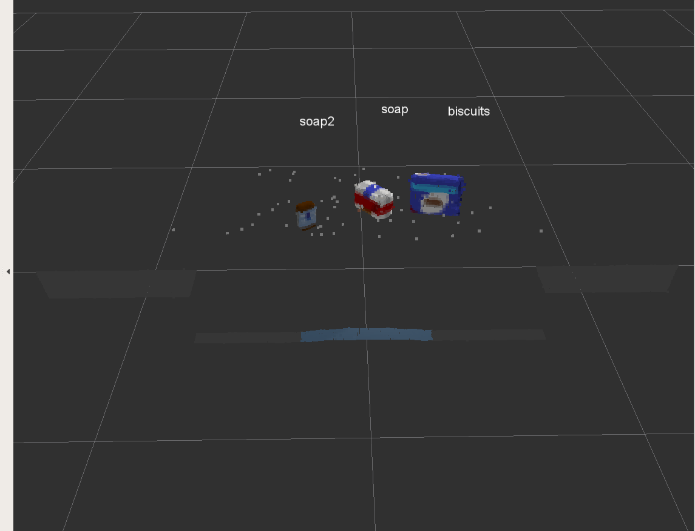
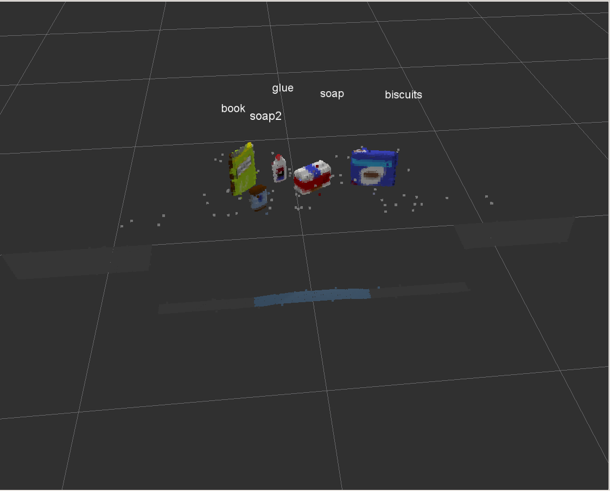
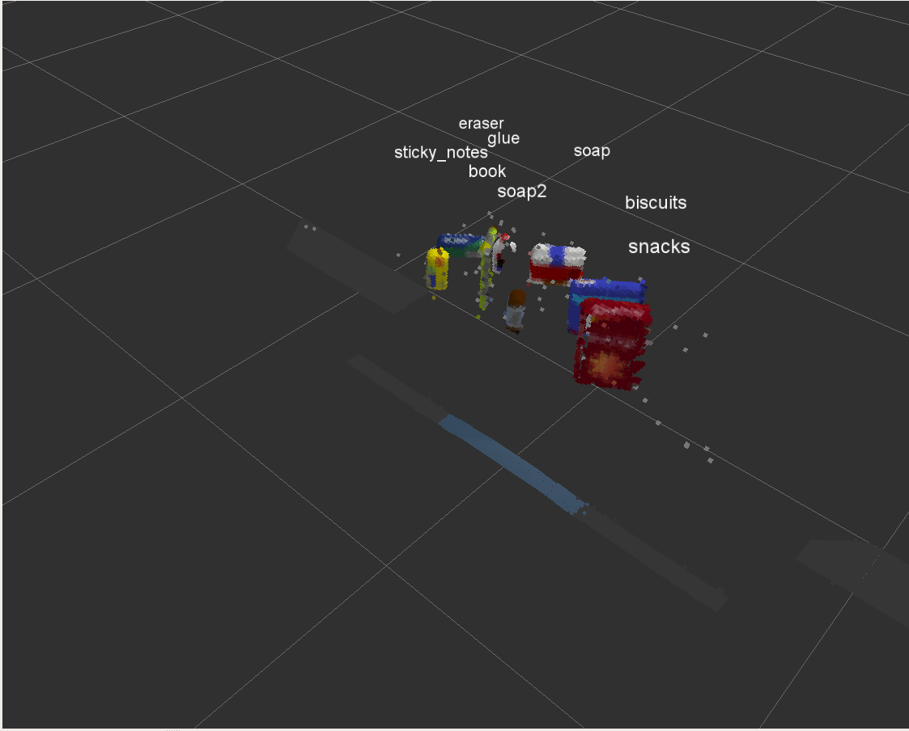

[](https://www.udacity.com/robotics)

# content 
1. Project overview
2. Setting up the environment
3. Project Setup
4. Filtering and segmentation
5. Euclidean Clustering with ROS and PCL
6. Object Recognition
7. creating `.yaml` files

# 1 - Project overview
A PR2 robot is in front of a table with multiple objects on it. It needs to pick the objects based on how they are ordered on a provided list (book, glue, snacks, soap, etc.) and place them into the object's designated bin. The robot has an RGBD feed, meaning it can see, and it can judge distances. Unfortunately, it does not know what the objects in the list are, what they look like, and how to identify them. It also does not know where the table ends, and where the objects on the table begin. To the robot, it all seems to appear as one single object.

As such, the tasks required to be accomplished in this project are the following. First, we need to enable the robot to segment the items on the table from each other, and from the table itself. It should know that the soap lying on the table is not part of the table, and that the table is not part of the soap. Secondly, we need to enable to robot to know what a book, or any of the other objects on the table look like, so that it will be able to identify one when seen. Lastly, once the robot is able to properly identify all the objects on the table, it should be able to pick these objects and place them into their designated bins.

# 2 - Setting up the environment
I have used the robo-nd VM to run this project.


# 3 - Project Setup
For this setup, catkin_ws is the name of active ROS Workspace, if your workspace name is different, change the commands accordingly
If you do not have an active ROS workspace, you can create one by:

```sh
$ mkdir -p ~/catkin_ws/src
$ cd ~/catkin_ws/
$ catkin_make
```

Now that you have a workspace, clone or download this repo into the src directory of your workspace:
```sh
$ cd ~/catkin_ws/src
$ git clone https://github.com/udacity/RoboND-Perception-Project.git
```
### Note: If you have the Kinematics Pick and Place project in the same ROS Workspace as this project, please remove the 'gazebo_grasp_plugin' directory from the `RoboND-Perception-Project/` directory otherwise ignore this note. 

Now install missing dependencies using rosdep install:
```sh
$ cd ~/catkin_ws
$ rosdep install --from-paths src --ignore-src --rosdistro=kinetic -y
```
Build the project:
```sh
$ cd ~/catkin_ws
$ catkin_make
```
Add following to your .bashrc file
```
export GAZEBO_MODEL_PATH=~/catkin_ws/src/RoboND-Perception-Project/pr2_robot/models:$GAZEBO_MODEL_PATH
```

If you haven’t already, following line can be added to your .bashrc to auto-source all new terminals
```
source ~/catkin_ws/devel/setup.bash
```
### NOTE : you should have sensor_stick folder from [here](https://github.com/AhmdNassar/3D-perception-exercises/tree/master/Exercise-3) in ``` ~/catkin_ws/src ``` 
To run the demo:
```sh
$ cd ~/catkin_ws/src/RoboND-Perception-Project/pr2_robot/scripts
$ chmod u+x pr2_safe_spawner.sh
$ ./pr2_safe_spawner.sh
```


Once Gazebo is up and running, make sure you see following in the gazebo world:
- Robot

- Table arrangement

- Three target objects on the table

- Dropboxes on either sides of the robot


If any of these items are missing, please report as an issue on [the waffle board](https://waffle.io/udacity/robotics-nanodegree-issues).

In your RViz window, you should see the robot and a partial collision map displayed:


Proceed through the demo by pressing the ‘Next’ button on the RViz window when a prompt appears in your active terminal

The demo ends when the robot has successfully picked and placed all objects into respective dropboxes (though sometimes the robot gets excited and throws objects across the room!)

Close all active terminal windows using **ctrl+c** before restarting the demo.

You can launch the project scenario like this:
```sh
$ roslaunch pr2_robot pick_place_project.launch
```
# 4 - Filtering and segmentation:
> All coming parts are implemented in [project_template.py](https://github.com/AhmdNassar/RoboND-Perception-Project/blob/master/pr2_robot/scripts/project_template.py) file  

first step is to isolate the objects of interest from the rest of the scene.

we do that by using two methods
### - PassThrough filter along Z and X using python-pcl 
```python
# Assign axis and range to the passthrough filter object
passthrough = cloud_filtered.make_passthrough_filter()
passthrough.set_filter_field_name("z")
axis_min = 0.5
axis_max = 0.8
passthrough.set_filter_limits(axis_min, axis_max)   


# Assign axis and range to the passthrough filter object.
filter_axis = 'x'
passthrough.set_filter_field_name(filter_axis)
axis_min = 0.4
axis_max = 1
passthrough.set_filter_limits(axis_min, axis_max)

# applay passThrough filters 
cloud_filtered = passthrough.filter()
```

### - ANSAC Plane Segmentation
```python
seg = cloud_filtered.make_segmenter()

# Set the model 
seg.set_model_type(pcl.SACMODEL_PLANE)
seg.set_method_type(pcl.SAC_RANSAC)

# Max distance for a point to be considered fitting the model
max_distance = 0.01
seg.set_distance_threshold(max_distance)

# Call the segment function to obtain set of inlier indices and model coefficients
inliers, coefficients = seg.segment()

# Extract inliers and outliers
cloud_table = cloud_filtered.extract(inliers,False)
cloud_objects = cloud_filtered.extract(inliers,True)
```
# 5 - Euclidean Clustering with ROS and PCL
we use euclidean clustering to cluster objects 
```python
 # Euclidean Clustering ( clustering objects )
white_cloud = XYZRGB_to_XYZ(cloud_objects)
tree = white_cloud.make_kdtree()

# Create a cluster extraction object
ec = white_cloud.make_EuclideanClusterExtraction()
# Set tolerances for distance threshold 
# as well as minimum and maximum cluster size (in points)
ec.set_ClusterTolerance(0.025)
ec.set_MinClusterSize(5)
ec.set_MaxClusterSize(1000)

# Search the k-d tree for clusters
ec.set_SearchMethod(tree)
# Extract indices for each of the discovered clusters
cluster_indices = ec.Extract()

# Create Cluster-Mask Point Cloud to visualize each cluster separately

#Assign a color corresponding to each segmented object in scene
cluster_color = get_color_list(len(cluster_indices))

color_cluster_point_list = []

for j, indices in enumerate(cluster_indices):
    for i, indice in enumerate(indices):
        color_cluster_point_list.append([white_cloud[indice][0],
                                    white_cloud[indice][1],
                                    white_cloud[indice][2],
                                        rgb_to_float(cluster_color[j])])

#Create new cloud containing all clusters, each with unique color
cluster_cloud = pcl.PointCloud_PointXYZRGB()
cluster_cloud.from_list(color_cluster_point_list)
```
# 6 - Object Recognition
Now we are ready to recognize objects using clusters from prevoious step, to do that we train SVM to recognize our objects, we do that in two steps

## feature extraction ( training data )
this part implemented in `capture_features.py` file in `sensor_stick` folder, after this step we will have `training_set.sav` file in `~\catkin_ws` and we will use this to train our SVM model 


we can do this step by this two commands 
```sh
$ roslaunch sensor_stick robot_spawn.launch
$ rosrun sensor_stick capture_features.py
```
## train SVM using sklearn 
this part is implemented in `train_svm.py` file in `sensor_stick` folder 
we can do this step by this command
```sh
$ rosrun sensor_stick train_svm.py
```
now we have `model.sav` in `~\catkin_ws`

## using SVM to recognize objects 
now we can use our model to recognize objects detected in front of our PR2 robot and publish labels to ros topic 
```python
detected_objects_labels = []
detected_objects = []
# Classify the clusters! (loop through each detected cluster one at a time)
for i,pts_list in enumerate(cluster_indices):
    # Grab the points for the cluster
    pcl_cluster = cloud_objects.extract(pts_list)
    ros_cluster = pcl_to_ros(pcl_cluster)
    # Compute the associated feature vector
    color_hist = compute_color_histograms(ros_cluster,True)
    normals = get_normals(ros_cluster)
    nhists = compute_normal_histograms(normals)
    feature = np.concatenate((color_hist, nhists))

    # Make the prediction
    prediction = clf.predict(scaler.transform(feature.reshape(1,-1)))
    label = encoder.inverse_transform(prediction)[0]
    detected_objects_labels.append(label)

    # Publish a label into RViz
    label_pos = list(white_cloud[pts_list[0]])
    label_pos[2] += .4
    object_markers_pub.publish(make_label(label,label_pos, i))

    # Add the detected object to the list of detected objects.
    do = DetectedObject()
    do.label = label
    do.cloud = ros_cluster
    detected_objects.append(do)

# Publish the list of detected objects
rospy.loginfo('Detected {} objects: {}'.format(len(detected_objects_labels), detected_objects_labels))

# Publish the list of detected objects
# This is the output you'll need to complete the upcoming project!
detected_objects_pub.publish(detected_objects)
```
# 7 - creating `.yaml` files
now we are ready to creat ros message and save them in `.yaml` files , we dow that using three functions 
```python 
# Helper function to create a yaml friendly dictionary from ROS messages
def make_yaml_dict(test_scene_num, arm_name, object_name, pick_pose, place_pose):
    yaml_dict = {}
    yaml_dict["test_scene_num"] = test_scene_num.data
    yaml_dict["arm_name"]  = arm_name.data
    yaml_dict["object_name"] = object_name.data
    yaml_dict["pick_pose"] = message_converter.convert_ros_message_to_dictionary(pick_pose)
    yaml_dict["place_pose"] = message_converter.convert_ros_message_to_dictionary(place_pose)
    return yaml_dict

# Helper function to output to yaml file
def send_to_yaml(yaml_filename, dict_list):
    print("save yaml file for : ",len(dict_list))
    data_dict = {"object_list": dict_list}
    with open(yaml_filename, 'w') as outfile:
        yaml.dump(data_dict, outfile, default_flow_style=False)
    print("finished")

# function to load parameters and request PickPlace service
def pr2_mover(object_list):

    # Initialize variables
    from std_msgs.msg import Int32
    from std_msgs.msg import String
    from geometry_msgs.msg import Pose


    test_scene_num = Int32()
    object_name = String()
    arm_name = String()
    pick_pose = Pose()
    place_pose = Pose()

    object_list_param = rospy.get_param('/object_list')
    dropbox_param = rospy.get_param('/dropbox')
    test_scene_num.data = 3

    # Loop through the pick list
    dict_list = []
    for i in range(len(object_list_param)):
	object_name.data = object_list_param[i]['name']
	object_group = object_list_param[i]['group']

    for j,object in enumerate(object_list):
        if object.label == object_name.data:
            # Get the PointCloud for a given object and obtain it's centroid
            points_arr = ros_to_pcl(object.cloud).to_array()
            centroid = np.mean(points_arr, axis=0)[:3]
            pick_pose.position.x = np.asscalar(centroid[0])
            pick_pose.position.y = np.asscalar(centroid[1])
            pick_pose.position.z = np.asscalar(centroid[2])	

                # Create 'place_pose' for the object
            if object_group == "green":
                position = dropbox_param[1]['position']
                arm_name.data = 'right'
            else:
                position = dropbox_param[0]['position']
                arm_name.data = 'left'

            place_pose.position.x = position[0]
            place_pose.position.y = position[1]
            place_pose.position.z = position[2]
    
        # Create a list of dictionaries (made with make_yaml_dict()) for later output to yaml format
        yaml_dict = make_yaml_dict(test_scene_num, arm_name, object_name,pick_pose, place_pose)
        dict_list.append(yaml_dict)

              

    # Outputrequest parameters into output yaml file
    send_to_yaml('output_.yaml', dict_list)
```
then we call `pr2_mover` at the end of `pcl_callback` function 

after all this steps we can apply our pipline to our 3 test world and this is the result 





